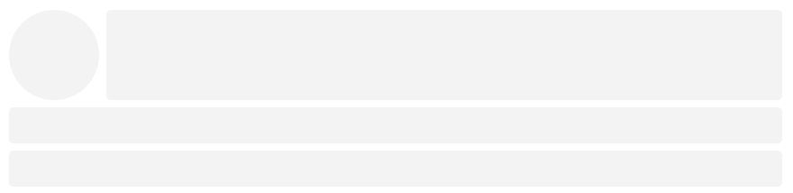

# Simple Svelte Skeleton

Simple components for skeleton to use in svelte 😎

## Usage Example

Demo



Import skeleton comonents

```javascript
import { Box, Column, Row } from "simple-svelte-skeleton";
```

Use the components

```html
<Column>
	<Row>
		<Column width="100px">
			<Box width="100%" height="100px" round />
		</Column>
		<Column stretch>
			<Box width="100%" height="100px" />
		</Column>
	</Row>
	<Box width="100%" height="40px" />
	<Box width="100%" height="40px" />
</Column>
```

## Install

Using `npm`:

````sh
npm install simple-svelte-skeleton
````

Using `yarn`:`

````sh
yarn add simple-svelte-skeleton
````

## API
For all the components `Column`, `Row` and `Box`, you can pass any CSS properties as props.

### `<Column>`

Stack components vertically and add spaces in-between. Currently it adds `8px` margin.

Props:

- All CSS properties
- *`stretch`* (boolean): Stretches the component so that it takes all the remaining space by adding inline CSS `flex-grow: 1`.

### `<Row>`

Stack components horizontally and add spaces in-between. Currently it adds `8px` margin.

Props:

- All CSS properties
- *`stretch`* (boolean): Stretches the component so that it takes all the remaining space by adding inline CSS `flex-grow: 1`.

### `<Box>`

A box made with `div` element.

Props:

- All CSS properties
- *`stretch`* (boolean): Stretches the component so that it takes all the remaining space by adding inline CSS `flex-grow: 1`.
- *`round`* (boolean): Makes the component circular by adding inline CSS `border-radius: 100%`.

